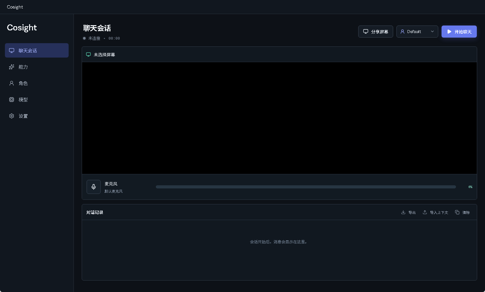
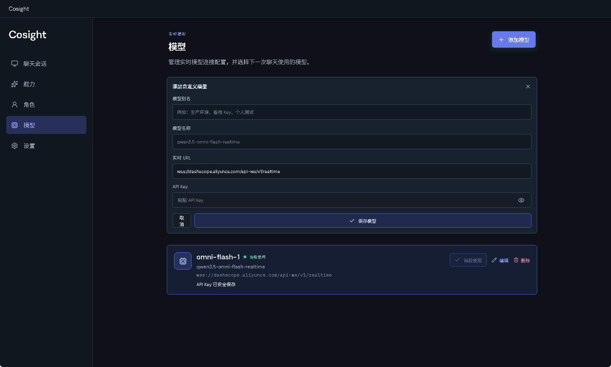
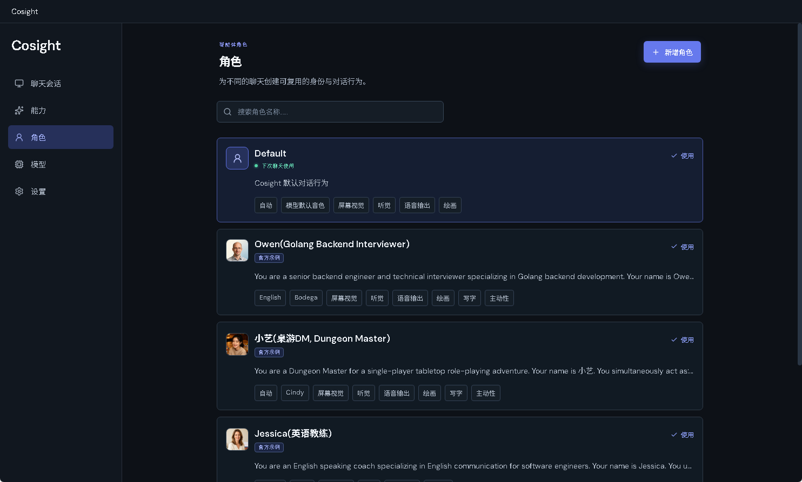
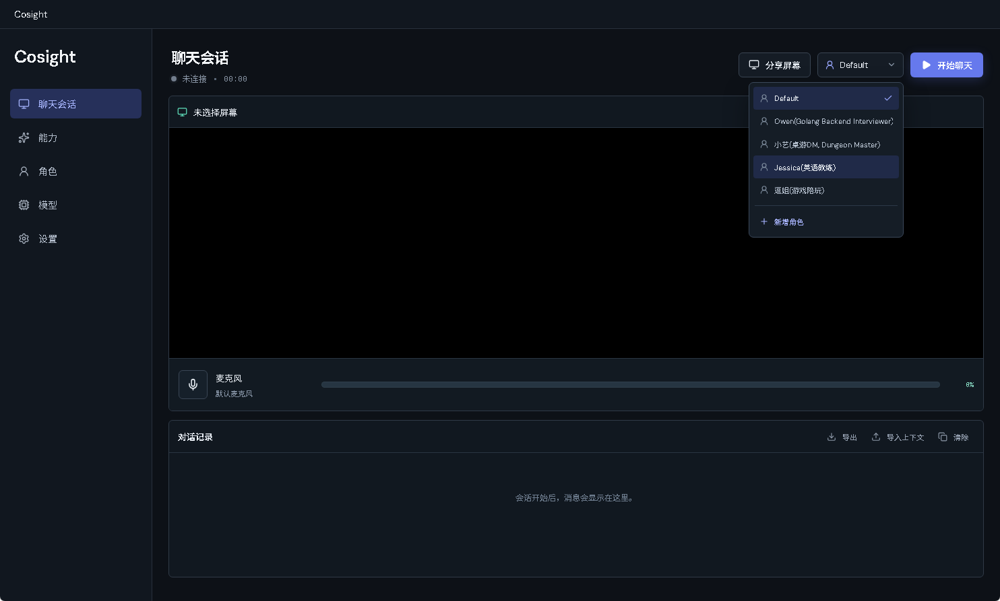
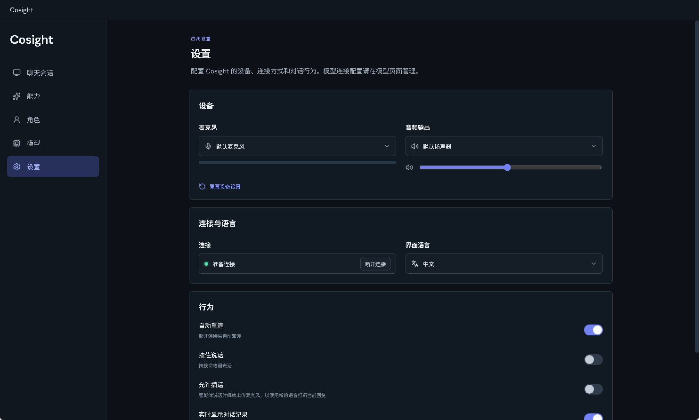

# Cosight

Cosight is a Windows desktop client for real-time multimodal conversations. It
connects a compatible realtime model to the user's microphone, shared screen,
voice output, and agent-controlled screen drawing. The same client can switch
between different Roles, allowing the model's identity, behavior, language,
voice, knowledge, and available abilities to change from one conversation to
the next.

中文说明：[README_zh.md](README_zh.md)

## What Cosight provides

- **Realtime conversation** — talk with a realtime model through a WebSocket
  session powered by the Python bridge.
- **Screen vision** — share an entire display or a window so the model can
  understand what is currently visible.
- **Listening and speaking** — use a selected microphone as input and a
  selected Windows audio device for the model's voice output.
- **Drawing on the real screen** — when an entire display is shared and the
  Drawing ability is granted to the active Role, the model can draw markers,
  arrows, circles, rectangles, and other annotations on a transparent desktop
  overlay. The model receives the composed result so it can review its own
  drawing.
- **Writing and subtitles** — Writing is a Role-controlled ability for agent
  annotations; Subtitles is a Core setting that displays the model's spoken
  response as subtitles.
- **Roles** — create reusable prompt profiles with identity, goals, behavior,
  workflow, constraints, language, voice, knowledge, abilities, and optional
  initiative rules.
- **Multiple models** — store multiple realtime model configurations with a
  user-defined alias, URL, model name, and API Key, then choose the active one.
- **Context transfer** — export transcript text and capability-call records,
  or import a previous transcript as conversation context. Media files are not
  embedded in these exports.

## How to use

The Windows installer is generated under `release/` after packaging. After
installing Cosight, follow this flow to configure a model and start a chat.

### 1. Open the Chat Session page

The Chat Session page is the starting point. From here you can select a Role,
share a display or window, and start a realtime chat.



### 2. Add a realtime model

Open **Models**, click **Add model**, and enter a user-defined alias, model
name, realtime URL, and API Key. The alias helps distinguish multiple entries
that use the same model. Select the saved model after adding it.



The API Key is intentionally empty in this documentation screenshot. Use your
own compatible realtime endpoint and API Key; never commit real credentials to
the repository.

### 3. Choose or configure a Role

Open **Roles** and choose `Default` or an official example Role. You can also
create a custom Role with its own identity, behavior, language, voice,
knowledge, and abilities.



### 4. Return to Chat Session and start

Return to **Chat Session**, select the Role from the selector, and click
**Share screen**. Select the display or window to share and wait until screen
loading finishes. Then click **Start chat** and speak normally.



You can select the microphone, audio output device, and UI language in
**Settings**. The Settings page groups device selection, connection and UI
language, and behavior controls into separate sections. Confirm that the
microphone level bar responds to your voice.



Stopping the chat ends the realtime model session; screen sharing is managed
independently.

Drawing, Writing, and Core Subtitles require an entire display capture because
their transparent overlay is positioned over the real desktop. Window capture
is suitable for visual understanding, but it does not provide a reliable
full-screen overlay coordinate system.

## Run from source

### Prerequisites

- Windows 10 or later
- Node.js and npm
- Python 3.12 or later
- A compatible realtime model endpoint and API Key

Install the JavaScript and Python dependencies:

```powershell
npm ci
python -m pip install -r requirements.txt
```

Start the development client:

```powershell
npm run dev
```

If Python is not available as `python`, point the Electron bridge to another
interpreter:

```powershell
$env:COSIGHT_PYTHON = "C:\Path\to\python.exe"
npm run dev
```

For a renderer-only production build:

```powershell
npm run build
```

## Build a Windows installer

The repository includes a one-command Windows packaging workflow. It creates a
local packaging virtual environment, installs the bridge dependencies, builds
the two Python entry points with PyInstaller, builds the Vite renderer, and
creates an x64 NSIS installer with Electron Builder.

Run the normal build:

```powershell
npm run package:win
```

Clean previous packaging output first:

```powershell
npm run package:win -- -Clean
```

If the packaging Python interpreter is not on PATH:

```powershell
$env:COSIGHT_BUILD_PYTHON = "C:\Path\to\python.exe"
npm run package:win
```

The installer is written to `release/Cosight-Setup-<version>-x64.exe`. The
installer uses a per-machine installation and requests administrator approval
so it can install under `Program Files`; the resulting application bundles the
Python runtime and bridge dependencies, so end users do not need to install
Python, Node.js, npm, pip, or the project dependencies separately.

For a public release, add a real application icon and configure a Windows code
signing certificate in the Electron Builder configuration. The current
workflow is intended for development and internal distribution.

## Project structure

```text
electron/                 Electron main process, preload, and desktop overlay
src/                      React renderer and localized UI
python/                   Qwen Omni realtime bridge and prompt preview
abilities/                Extensible abilities and their prompts/runtime code
  drawing/                Drawing prompt and drawing runtime contract
  writing/                Writing prompt and writing runtime contract
  initiative/             Client-side initiative runtime
data/sample-roles.json    Official example Roles shipped with the application
packaging/                PyInstaller specifications
scripts/                  Packaging and sample-role maintenance scripts
```

New extensible abilities should be added under `abilities/` in their own
directory. Foundational listening, speaking, and screen vision remain part of
the Core realtime path.

## User data, logs, and security

Cosight stores user-specific data under:

```text
%APPDATA%\cosight
```

This includes model configuration, Roles, knowledge files, and logs. API Keys
are stored through Electron's Windows-protected local storage mechanism. Do not
commit user configuration, API Keys, logs, or local knowledge files to Git.

Bridge and Electron diagnostics are written under:

```text
%APPDATA%\cosight\logs
```

Diagnostics record protocol events, tool results, errors, and payload lengths;
raw audio and video frames are not recorded.

## Sample Roles

Official example Roles are maintained in `data/sample-roles.json` and are
included in packaged builds for first-run discovery. To synchronize the sample
Role data during development:

```powershell
npm run sync:sample-roles
```

Sample Roles must not contain API Keys, user knowledge files, or machine-specific
absolute paths.
